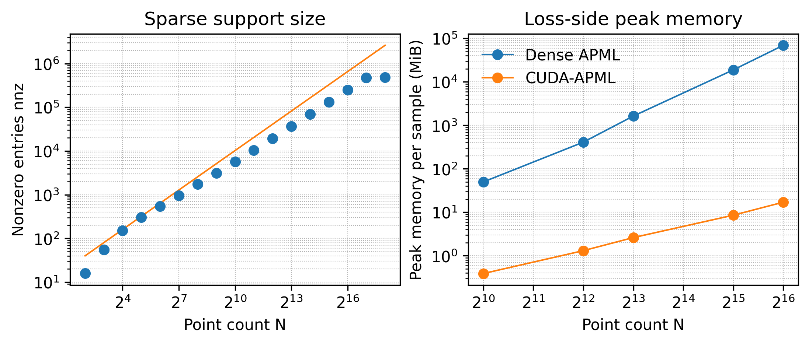

# CUDA-APML: CUDA-Optimized APML Implementation

[](./LICENSE)


This repository contains the CUDA-focused implementation used for the paper:

**From Theory to Throughput: CUDA-Optimized APML for Large-Batch 3D Learning**

## Overview

CUDA-APML is a sparse GPU implementation of APML that exploits the empirical sparsity of the transport plan after adaptive softmax thresholding. The implementation uses sparse COO construction, on-device symmetrization, and sparse Sinkhorn normalization to reduce memory usage and improve throughput for large-batch 3D learning.

## Scaling Visualization



The figure summarizes synthetic scaling analyses: nonzero COO entries after symmetrization across increasing point counts and peak memory per sample for dense APML versus CUDA-APML.

## Installation

Requirements:

- Python 3.8+
- PyTorch 1.12+ with CUDA
- CUDA toolkit (NVCC)
- C++17-compatible compiler

```bash
pip install -r requirements.txt

cd src/apml_cuda
python setup.py install
cd ../../
```

## Quick Start

```python
import torch
from src.loss.apml_sparse_loss import APMLSparse

criterion = APMLSparse(p_min=0.8, threshold=1e-10)

B, N, M, D = 4, 2048, 2048, 3
pred = torch.randn(B, N, D, device="cuda")
gt = torch.randn(B, M, D, device="cuda")

loss = criterion(pred, gt)
loss.backward()
```

## Repository Structure

```text
.
├─ docs/
│  └─ images/
│     └─ scaling.png
├─ src/
│  ├─ APML/
│  │  └─ README.md                # APML code
│  ├─ apml_cuda/
│  │  ├─ setup.py
│  │  ├─ apml_sparse.cpp
│  │  └─ apml_sparse_kernel.cu
│  └─ loss/
│     └─ apml_sparse_loss.py      # autograd wrapper for the CUDA op
├─ models/
├─ requirements.txt
├─ LICENSE
└─ README.md
```


